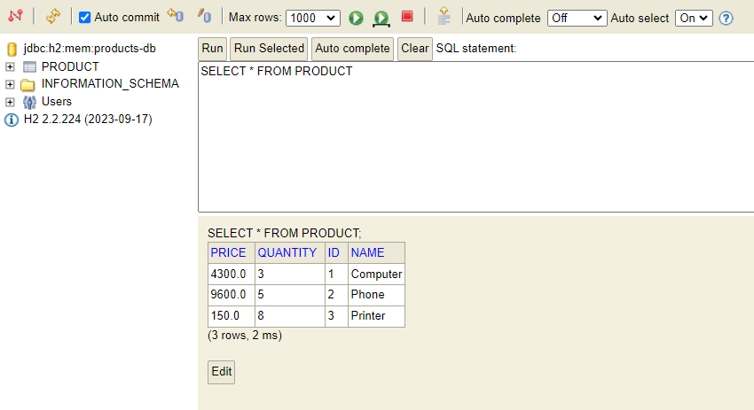
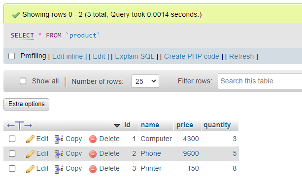
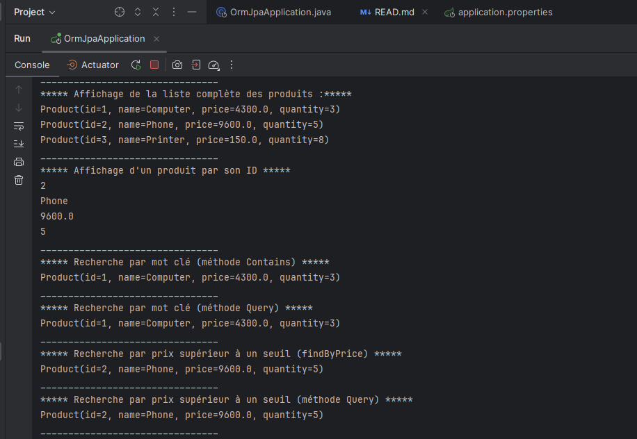
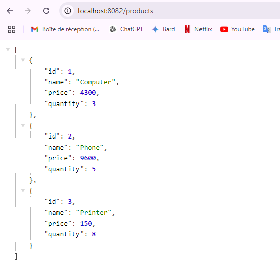
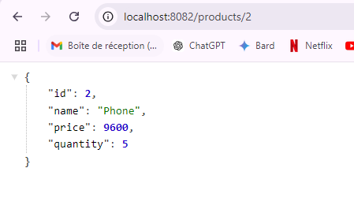

<h1>ORM JPA Hibernate Spring Data</h1>
<h2>Base de données H2 avec les données des produits</h2>

<h2>Affichage des produits dans MySQL via PHPMyAdmin</h2>

<h2>Affichage des résultats des opérations en console</h2>

<h2>Affichage de tous les produits disponibles via l'API</h2>

<h2>Affichage d'un produit spécifique avec son ID via l'API</h2>

